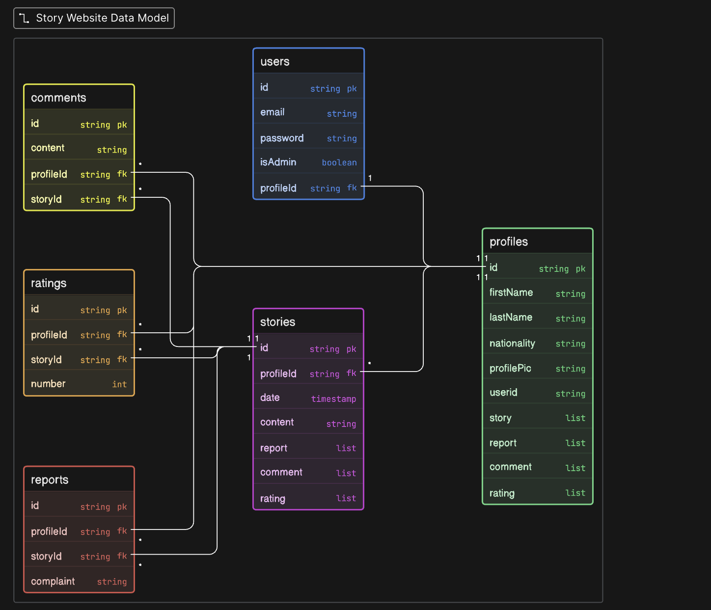

# Stories API

A RESTful backend for a community storytelling platform where users can write, share, and engage with short stories. Built with Spring Boot, secured with JWT authentication, and backed by PostgreSQL.

---

## What It Does

Stories is a platform where writers can publish their work and readers can interact with it. Users register, verify their email, and then have access to a feed of stories they can read, rate, and comment on. Writers own their stories and can delete them. Admins have elevated permissions to moderate content and manage users.

Profile images are stored via Cloudinary, and all sensitive account flows (email verification, password reset) are handled through time-limited secure tokens sent by email.

---

## Diagram

## Tech Stack

- **Java 17** / **Spring Boot 4**
- **Spring Security** with stateless JWT authentication
- **Spring Data JPA** / **Hibernate** with **PostgreSQL**
- **Cloudinary** for profile image uploads
- **Spring Mail** + **Thymeleaf** for transactional emails
- **Lombok** for boilerplate reduction

---

## User Stories

### Authentication & Account Management
- As a new user, I can register with my name, email, and password so I can join the platform.
- As a registered user, I receive a verification email and must confirm my account before it is fully active.
- As a user, I can log in with my email and password and receive a JWT token to authenticate future requests.
- As a logged-in user, I can change my password by providing my current password and a new one.

### Stories
- As a logged-in user, I can browse a feed of all published stories with their title, author, rating, and publish date.
- As a logged-in user, I can read the full content of a specific story along with its comments.
- As a logged-in user, I can publish a new story with a title and content. Duplicate titles are rejected.

### Engagement
- As a logged-in user, I can leave a comment on any story.
- As a logged-in user, I can rate a story with a numeric score.

---

## API Endpoints

All endpoints under `/stories` require a valid JWT in the `Authorization: Bearer <token>` header. Endpoints under `/auth/**` are publicly accessible.

### Auth & Users — `/auth/users`

| Method | Endpoint | Auth | Description |
|--------|----------|------|-------------|
| `POST` | `/auth/users/register` | Public | Register a new user |
| `POST` | `/auth/users/login` | Public | Log in and receive a JWT |
| `GET` | `/auth/users/register/verify?token=` | Public | Verify email address via token |
| `GET` | `/auth/users/forgot-password` | Public | Request a password reset email |
| `POST` | `/auth/users/reset-password?token=` | Public | Set a new password using reset token |
| `PUT` | `/auth/users/change-password` | Required | Change password (requires old password) |
| `GET` | `/auth/users/profile` | Required | Get the current user's profile |
| `POST` | `/auth/users/profile-image` | Required | Upload a profile image (multipart/form-data) |
| `DELETE` | `/auth/users/delete` | Required | Soft-delete own account |
| `DELETE` | `/auth/users/delete/{id}` | Required (Admin) | Soft-delete a user by ID |

### Stories — `/stories`

| Method | Endpoint | Auth | Description |
|--------|----------|------|-------------|
| `GET` | `/stories` | Required | List all stories (summary view) |
| `GET` | `/stories/{storyId}` | Required | Get a single story with full details and comments |
| `POST` | `/stories` | Required | Create a new story |
| `DELETE` | `/stories/{storyId}` | Required | Delete a story (owner or admin only) |
| `POST` | `/stories/{storyId}/comments` | Required | Add a comment to a story |
| `POST` | `/stories/{storyId}/rating` | Required | Rate a story |

---
